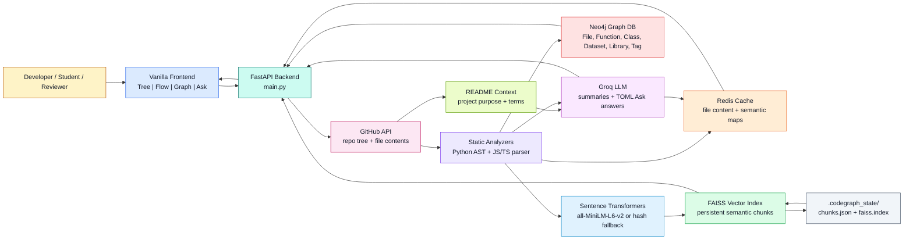
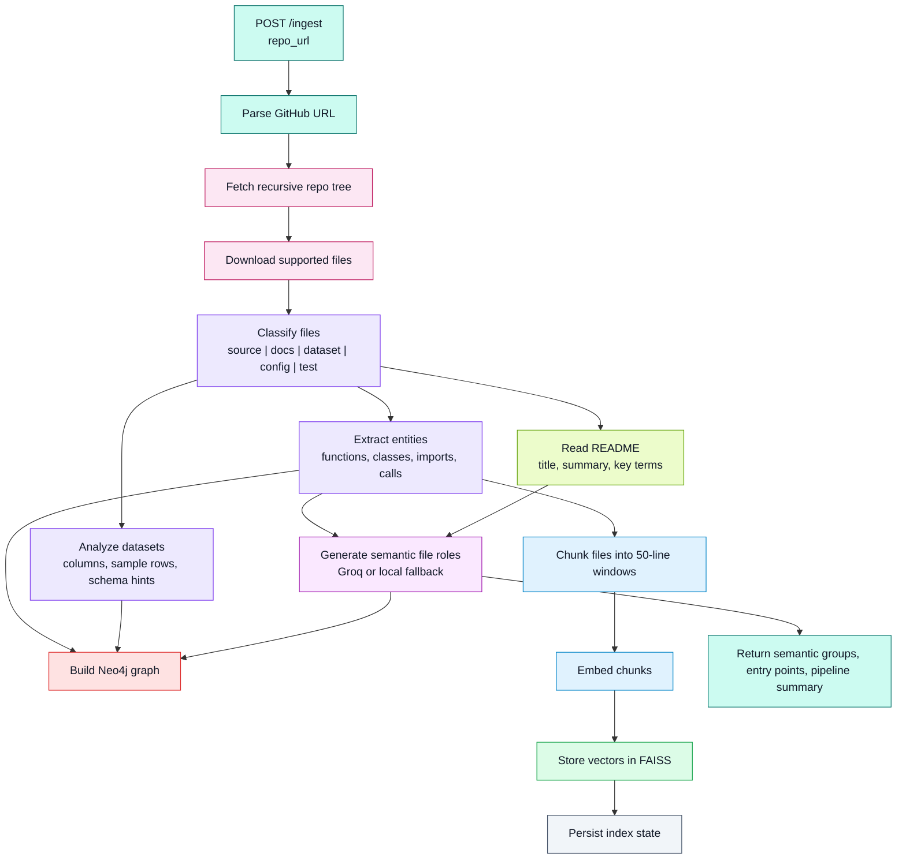

# CodeGraph AI

CodeGraph AI turns any GitHub repository into an interactive architecture explorer. It ingests source files, README documentation, datasets, imports, functions, classes, and semantic metadata, then exposes the result through a FastAPI backend and a vanilla browser UI with Tree, Flow, Graph, Explain, and Ask-the-Codebase views.

The project is designed for developers, students, reviewers, and maintainers who want to understand a codebase quickly without manually opening every file.

## Table Of Contents

- [Project Overview](#project-overview)
- [Core Capabilities](#core-capabilities)
- [Architecture](#architecture)
- [Repository Analysis Workflow](#repository-analysis-workflow)
- [Ask-The-Codebase Modes](#ask-the-codebase-modes)
- [Tech Stack](#tech-stack)
- [Project Structure](#project-structure)
- [Setup](#setup)
- [Environment Variables](#environment-variables)
- [Running The App](#running-the-app)
- [Using The UI](#using-the-ui)
- [API Reference](#api-reference)
- [Persistence And Caching](#persistence-and-caching)
- [Troubleshooting](#troubleshooting)
- [Security Notes](#security-notes)

## Project Overview

CodeGraph AI analyzes a GitHub repository and produces multiple synchronized views:

- **Visual Tree**: folder/file hierarchy enriched with semantic roles.
- **Architecture Flow**: stage-based system flow showing ingestion, processing, retrieval, inference, output, and utility layers.
- **Presentation Graph**: simplified architecture graph for human understanding.
- **Raw Graph Views**: file, function, class, library, dataset, and tag relationships.
- **Node Detail**: focused file view with responsibilities, relations, and annotated code.
- **Line-by-Line Explanation**: student-friendly walkthrough of selected files.
- **Ask The Codebase**: RAG-style question answering over indexed chunks, README context, tree context, flow context, and graph context.

The backend combines deterministic static analysis with optional LLM summaries. If Groq is unavailable or rate-limited, the app falls back to local rule-based analysis and indexed repository context instead of crashing.

## Core Capabilities

| Capability | What It Does |
|---|---|
| GitHub ingestion | Fetches recursive repository tree and downloads supported files. |
| README-aware analysis | Reads README files when present and uses them to improve Tree, Flow, Graph, and Ask views. |
| Static parsing | Extracts functions, classes, imports, calls, globals, and rough complexity for Python. |
| JS/TS parsing | Extracts imports, functions, classes, and calls from JavaScript and TypeScript with regex-based parsing. |
| Dataset handling | Detects CSV, TSV, JSON, YAML, XML, Parquet, and related structured data assets. |
| Neo4j graph | Stores files, datasets, functions, classes, libraries, tags, and relationships. |
| FAISS search | Indexes 50-line chunks for semantic retrieval and Ask-the-Codebase answers. |
| Persistent index | Saves chunk metadata and FAISS index under `.codegraph_state/` so chunks survive backend restarts. |
| Groq summaries | Optionally produces file roles, architecture diagrams, presentation graphs, and answers. |
| Local fallback | Uses static metadata and indexed chunks if Groq is missing, exhausted, or rate-limited. |
| Frontend UI | Vanilla HTML/CSS/JS interface served directly by FastAPI. |

## Architecture



### Component Responsibilities

| Layer | Files / Modules | Responsibility |
|---|---|---|
| Frontend | `frontend/index.html`, `frontend/app.js`, `frontend/styles.css` | Browser UI for ingestion, tree, flow, graph, file details, explanations, and Ask modes. |
| API server | `main.py` | FastAPI app, GitHub ingestion, endpoints, view generation, LLM prompts, fallback logic. |
| Clients | `app/clients.py` | Groq, Neo4j, Redis, FAISS, embeddings, persistent index state. |
| Configuration | `app/config.py` | Environment variable loading and defaults. |
| Constants | `app/constants.py` | Supported extensions, stage order, colors, built-in modules. |
| Schemas | `app/schemas.py` | Pydantic request models. |
| Local state | `.codegraph_state/` | Saved FAISS index and chunk metadata. |

## Repository Analysis Workflow



## Ask-The-Codebase Modes

The Ask section sends an explicit `answer_mode` to the backend. The backend builds context from README, file catalog, tree, flow, graph relations, and semantic chunks.

| Mode | Behavior |
|---|---|
| Auto Mode | Infers the best answer style from the question. |
| Tree View | Organizes the answer by folders and files. |
| Flow View | Explains ordered execution, data movement, and pipeline stages. |
| Graph View | Focuses on dependencies, imports, calls, and relationships. |
| Student Explanation | Uses simpler step-by-step explanation. |
| Debugging Help | Points to likely issue locations and first checks. |
| Professional Summary | Gives a concise engineering summary. |

LLM answers are requested as compact **TOML** instead of verbose JSON to reduce output tokens. If Groq is rate-limited, the backend returns a local structured answer instead of a 500 error.

## Tech Stack

| Area | Technology |
|---|---|
| API | FastAPI, Uvicorn |
| Frontend | Vanilla HTML, CSS, JavaScript, SVG |
| Graph database | Neo4j |
| Cache | Redis |
| Vector search | FAISS |
| Embeddings | `sentence-transformers/all-MiniLM-L6-v2`, with deterministic hash fallback |
| LLM | Groq API, configurable model |
| GitHub access | GitHub REST API |
| Data parsing | Python AST, CSV/JSON readers, regex-based JS/TS parser |

## Project Structure

```text
CodeGraph AI/
├── app/
│   ├── __init__.py
│   ├── clients.py          # Groq, Neo4j, Redis, FAISS, embeddings, persistent index state
│   ├── config.py           # Environment variables and defaults
│   ├── constants.py        # Supported file types, colors, stage order
│   └── schemas.py          # Pydantic request schemas
├── frontend/
│   ├── index.html          # Browser UI
│   ├── app.js              # UI logic, SVG renderers, API calls
│   └── styles.css          # App styling
├── .codegraph_state/       # Saved FAISS index and chunk metadata
├── .env.example            # Safe environment template
├── .gitignore
├── description.md
├── docker-compose.yml      # Optional Neo4j + Redis services
├── main.py                 # FastAPI app and repository analysis logic
├── README.md
└── requirements.txt
```

## Setup

### 1. Clone The Repository

```bash
git clone https://github.com/vinaykr8807/CodeGraph-AI.git
cd CodeGraph-AI
```

If your local folder contains a space, commands still work, but wrap paths in quotes when needed.

### 2. Create A Virtual Environment

```bash
python -m venv .venv
source .venv/bin/activate
```

On Windows PowerShell:

```powershell
python -m venv .venv
.\.venv\Scripts\Activate.ps1
```

### 3. Install Dependencies

```bash
pip install -r requirements.txt
```

The first embedding load may use a cached local model. If `sentence-transformers/all-MiniLM-L6-v2` is unavailable, the app falls back to deterministic hash embeddings so the server can still run.

### 4. Create `.env`

```bash
cp .env.example .env
```

Edit `.env` with your local settings. Do not commit `.env`; it is ignored by Git.

## Environment Variables

```env
GITHUB_TOKEN=your_github_token_here
GROQ_API_KEY=your_groq_api_key_here
GROQ_MODEL=llama-3.3-70b-versatile
NEO4J_URI=neo4j+s://your-instance.databases.neo4j.io
NEO4J_USERNAME=neo4j
NEO4J_PASSWORD=your_neo4j_password_here
NEO4J_DATABASE=neo4j
REDIS_HOST=localhost
REDIS_PORT=6379
```

| Variable | Required | Description |
|---|---:|---|
| `GITHUB_TOKEN` | Recommended | Improves GitHub API limits and enables private repository access. |
| `GROQ_API_KEY` | Optional | Enables LLM-powered summaries, diagrams, file explanations, and Ask answers. |
| `GROQ_MODEL` | Optional | Groq model name. Defaults to `llama-3.3-70b-versatile`. |
| `NEO4J_URI` | Required | Neo4j connection URI, for example `bolt://localhost:7687` or Aura URI. |
| `NEO4J_USERNAME` | Required | Neo4j username. Usually `neo4j`. |
| `NEO4J_PASSWORD` | Required | Neo4j password. |
| `NEO4J_DATABASE` | Optional | Neo4j database name. Defaults to server default if blank. |
| `REDIS_HOST` | Required | Redis host. Use `localhost` for local Redis. |
| `REDIS_PORT` | Required | Redis port. Usually `6379`. |
| `EMBEDDING_MODEL` | Optional | Embedding model. Defaults to `sentence-transformers/all-MiniLM-L6-v2`. |
| `ALLOW_EMBEDDING_MODEL_DOWNLOAD` | Optional | Set to `true` to allow model download. If false, local cache is used first. |

### Local Neo4j And Redis With Docker

If you do not already have Neo4j and Redis running, start them with:

```bash
docker compose up -d
```

Then set `.env` values to match your Docker services. A common local setup is:

```env
NEO4J_URI=bolt://localhost:7687
NEO4J_USERNAME=neo4j
NEO4J_PASSWORD=your_actual_password
NEO4J_DATABASE=neo4j
REDIS_HOST=localhost
REDIS_PORT=6379
```

## Running The App

Start the API:

```bash
uvicorn main:app --reload
```

Open the frontend:

```text
http://localhost:8000
```

FastAPI serves the frontend directly. Static files are also available under `/frontend`.

## Using The UI

### 1. Health Check

Click **Health** to verify:

- Redis connection
- Neo4j connection
- GitHub token status
- Groq configuration
- FAISS chunk count

If `Chunks: 0`, ingest a repo. The app also rebuilds missing chunks from cached file analysis when views are loaded.

### 2. Ingest A Repository

Enter a GitHub repository URL:

```text
https://github.com/owner/repo
```

Then click **Analyze / Ingest**. The backend will:

- fetch the repository tree
- download supported files
- parse code entities
- read README if present
- analyze datasets
- build Neo4j graph nodes and edges
- chunk files
- embed chunks
- save FAISS index under `.codegraph_state/`

### 3. Explore Views

| View | Purpose |
|---|---|
| Tree | Understand folder/file organization. |
| Flow | Understand architecture and stage-by-stage execution. |
| Graph | Understand components, dependencies, raw files, and grouped symbols. |
| Ask | Ask natural-language questions in different modes. |

### 4. README-Aware Views

Tree, Flow, and Graph include a **Read README** option. When enabled, the backend reads README files if they exist and uses them to improve:

- project title
- purpose summary
- key terms
- component labels
- architecture wording

Supported README names:

- `README.md`
- `readme.md`
- `README.rst`
- `README.txt`

## API Reference

### `POST /ingest`

Analyzes a GitHub repository and stores metadata.

```bash
curl -X POST http://localhost:8000/ingest \
  -H "Content-Type: application/json" \
  -d '{"repo_url":"https://github.com/owner/repo"}'
```

Returns:

- processed file count
- skipped file count
- indexed chunk count
- semantic groups
- entry points
- pipeline description

### `GET /view/tree/{owner}/{repo}`

Returns enriched hierarchy data.

Optional query:

```text
?use_readme=true
```

### `GET /view/pipeline/{owner}/{repo}`

Returns stage-based pipeline flow.

### `GET /view/architecture-diagram/{owner}/{repo}`

Returns a presentation-ready architecture flow model.

Optional query:

```text
?use_readme=true
```

### `GET /view/presentation-graph/{owner}/{repo}`

Returns simplified component graph data for the Graph UI.

Optional query:

```text
?use_readme=true
```

### `GET /view/graph/{owner}/{repo}`

Returns raw graph nodes and edges from Neo4j.

Optional queries:

```text
?filter_type=files_only
?filter_type=with_functions
?filter_type=full
?use_readme=true
```

### `GET /view/node/{owner}/{repo}?file_path=...`

Returns focused file detail:

- file role
- responsibilities
- outgoing relations
- incoming relations
- annotated code lines

### `GET /explain/file/{owner}/{repo}?file_path=...&max_lines=80`

Returns a student-style explanation for a selected file. Uses Groq when available and local fallback otherwise.

### `POST /query`

Asks a question about the repository.

```bash
curl -X POST http://localhost:8000/query \
  -H "Content-Type: application/json" \
  -d '{
    "repo_url": "https://github.com/owner/repo",
    "question": "Where is the main logic?",
    "answer_mode": "flow",
    "file_path": null
  }'
```

Supported `answer_mode` values:

- `auto`
- `tree`
- `flow`
- `graph`
- `student`
- `debugger`
- `professional`

### `GET /architecture/{owner}/{repo}`

Returns Mermaid architecture summary from cached semantic analysis.

### `GET /health`

Returns runtime status:

- Redis
- Neo4j
- Groq
- GitHub token
- FAISS chunk count
- persistent index state
- embedding backend

## Persistence And Caching

### Redis

Redis stores temporary cached values:

- GitHub file content
- Groq file analysis
- semantic maps
- file analysis arrays
- query answers

### Neo4j

Neo4j stores graph structure:

- `File`
- `Dataset`
- `Function`
- `Class`
- `Library`
- `Tag`

Relationships:

- `DEFINES`
- `IMPORTS`
- `TAGGED`
- `DEPENDS_ON`
- `CALLS_INTO`
- `USES_DATASET`

### FAISS And `.codegraph_state`

The vector index and chunk metadata are persisted locally:

```text
.codegraph_state/
├── chunks.json
└── faiss.index
```

This prevents `Chunks: 0` after backend restart. If chunks are missing but file analysis exists, loading Tree, Flow, Graph, or Ask triggers a self-heal rebuild.

## Supported Files

Source extensions:

```text
.py, .js, .ts, .java, .cpp, .c, .go, .rb, .rs
```

Data extensions:

```text
.csv, .json, .xml, .yaml, .yml, .parquet, .tsv
```

Documentation:

```text
README.md, README.txt, README.rst, .md, .rst, .txt
```

## Troubleshooting

### `Chunks: 0`

Run ingest again or load Tree/Flow/Graph after restarting the backend. The app now rebuilds missing chunks from cached file analysis. If it still stays zero, check:

- GitHub URL is valid
- repository has supported files
- backend can fetch file content
- `.codegraph_state/` is writable
- embedding model can load or hash fallback is active

### Groq Rate Limit

If Groq returns `429 rate_limit_exceeded`, Ask will return a local indexed answer instead of failing. Wait for the Groq quota reset or use a lower-volume model.

### Neo4j Connection Fails

Check:

- `NEO4J_URI`
- `NEO4J_USERNAME`
- `NEO4J_PASSWORD`
- `NEO4J_DATABASE`
- whether Neo4j is running

For local Docker:

```bash
docker compose up -d
```

### Redis Connection Fails

Start Redis locally or through Docker. Then verify:

```env
REDIS_HOST=localhost
REDIS_PORT=6379
```

### Embedding Model Cannot Download

By default, the app tries local model files first. If unavailable, it uses hash fallback. To allow download:

```env
ALLOW_EMBEDDING_MODEL_DOWNLOAD=true
```

## Security Notes

- Do not commit `.env`.
- Use `.env.example` for safe defaults.
- Avoid pushing real API keys, GitHub tokens, or Neo4j passwords.
- Be careful when ingesting private repositories; indexed chunks may include proprietary code.
- `.codegraph_state/` stores chunk text and vectors, so treat it as repository-derived data.

## Development Notes

Useful checks:

```bash
python -m py_compile main.py app/*.py
node --check frontend/app.js
```

Run server:

```bash
uvicorn main:app --reload
```

Open UI:

```text
http://localhost:8000
```

## License

No license file is currently included. Add a license before publishing this project for wider reuse.
